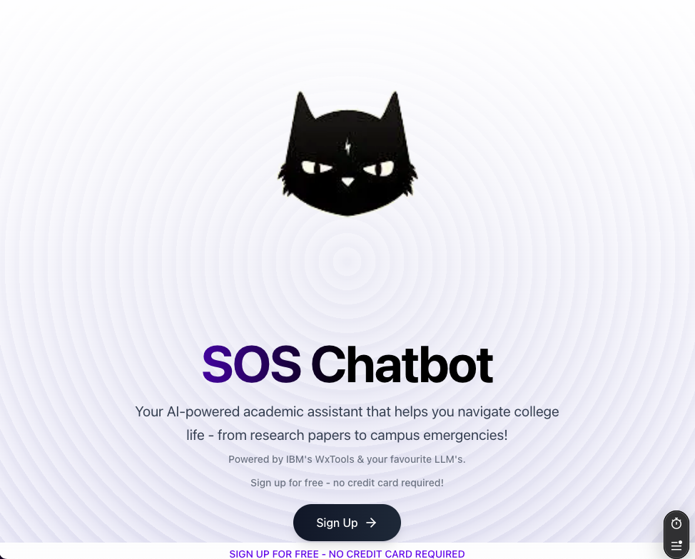
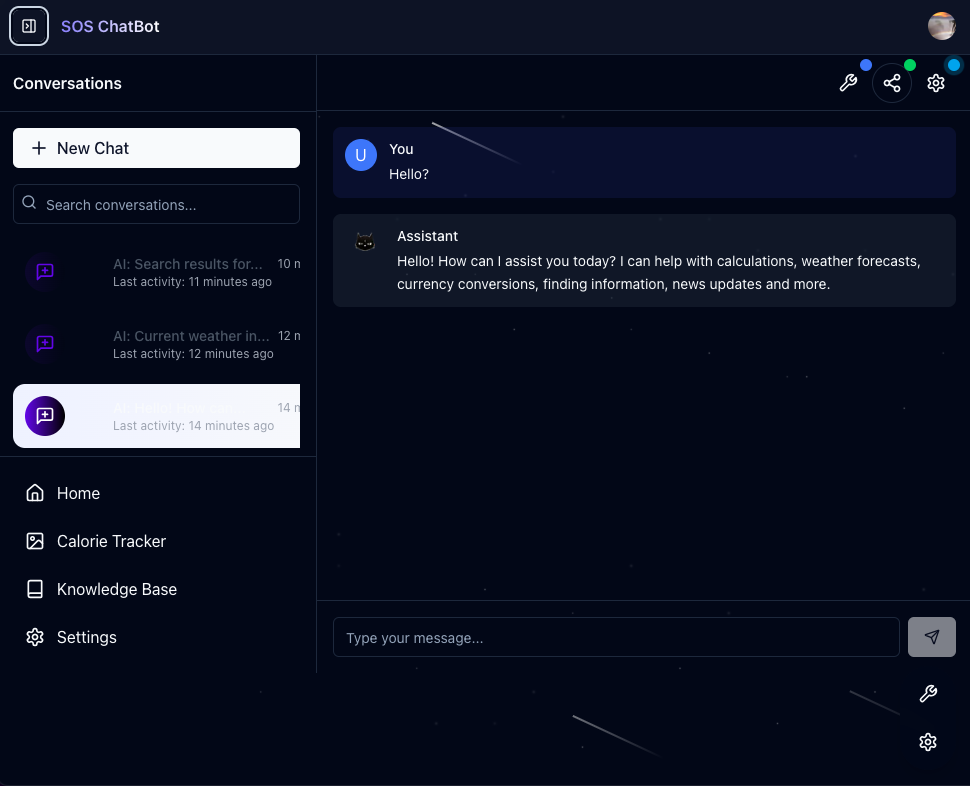

# SOS Chatbot

A powerful AI chatbot built with Next.js, LangChain, and Google's Gemini AI.




# Check out the [**LIVE DEMO**!!](https://sos-chatbot-github-io-bgmloop-bgmloops-projects.vercel.app)

## Features

- 🤖 Advanced AI capabilities powered by LangChain and Google's Gemini AI
- 🎨 Image generation with Gemini 2.0 Flash (Experimental)
- 🔐 Secure authentication with Clerk
- 💾 Real-time database with Convex
- 🎨 Modern UI with Tailwind CSS
- 📱 Responsive design
- 🔄 Real-time chat with streaming responses
- 🛠️ Tool integration (web search, calculator, weather)
- 📝 Markdown support for messages
- 🔍 Advanced search capabilities
- **AI-Powered Chat**: Engage with a state-of-the-art language model for assistance
- **Chat History**: Persistent chat history for all your conversations
- **Responsive Design**: Optimized for both desktop and mobile devices
- **User Authentication**: Secure login with email or social accounts
- **Dark Mode**: Toggle between light and dark themes for comfortable viewing
- **Tool Integration**: Use AI tools for math, currency conversion, weather, news, and more
- **UI Controls**: Customize your experience with chat settings, share your conversations, and explore tool examples

## Tech Stack

- **Frontend**: Next.js 14, React, Tailwind CSS
- **Backend**: Next.js API Routes
- **AI**: 
  - LangChain with Google's Gemini AI
  - Primary Model: Gemini 2.5 Pro Experimental (03-25)
  - Image Generation: Gemini 2.0 Flash (Experimental)

- **Authentication**: Clerk
- **Database**: Convex
- **Deployment**: Vercel

## Getting Started

### Prerequisites

- Node.js 18+ and pnpm
- Clerk API keys
- Convex account and API keys

### Installation

1. Clone the repository:
```bash
git clone https://github.com/yourusername/sos-chatbot.github.io.git
cd sos-chatbot.github.io
```

2. Install dependencies:
```bash
pnpm install
```

3. Set up environment variables:
```bash
cp .env.example .env.local
```
Edit `.env.local` with your API keys and configuration.

4. Start the development server:
```bash
pnpm dev
```

5. Open [http://localhost:3000](http://localhost:3000) in your browser.

## Project Structure

```
sos-chatbot.github.io/
├── app/                    # Next.js app directory
├── components/            # React components
├── lib/                   # Utility functions and shared code
├── public/               # Static assets
├── convex/               # Convex database schema and functions
└── docs/                 # Documentation
```

## Contributing

1. Fork the repository
2. Create your feature branch (`git checkout -b feature/amazing-feature`)
3. Commit your changes (`git commit -m 'Add some amazing feature'`)
4. Push to the branch (`git push origin feature/amazing-feature`)
5. Open a Pull Request

## License

This project is licensed under the MIT License - see the [LICENSE](LICENSE) file for details.

## Acknowledgments

- Google's Gemini AI for providing the AI engine
- LangChain for the powerful LLM framework
- Clerk for authentication
- Convex for the real-time database
- The Next.js team for the amazing framework

## UI Components

### Chat Settings

The Chat Settings component allows users to customize their chat experience with the following options:

- **Theme**: Toggle between light and dark mode
- **Font Size**: Adjust text size for better readability
- **Layout**: Toggle sidebar visibility
- **Accent Color**: Choose from various color themes
- **Reset Settings**: Restore default settings

### Share Conversation

The Share Conversation component enables users to share their chats in various ways:

- **Link Sharing**: Generate a shareable link with customizable expiration
- **Social Media**: Share directly to Twitter, Facebook, LinkedIn, or via email
- **Export Options**: Copy conversation text or download as a file
- **Privacy Controls**: Choose whether to include system messages

### Tools Examples

The Tools Examples component showcases available tools and provides example prompts:

- **Categorized Tools**: Browse tools by category (Utilities, Information, Search)
- **Example Prompts**: Ready-to-use example queries for each tool
- **Quick Access**: Use examples directly in your conversation with a single click
- **Copy Function**: Copy examples to use later
